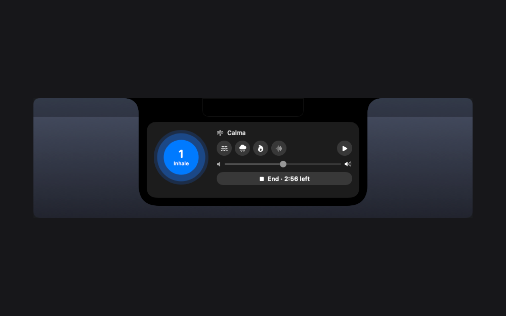
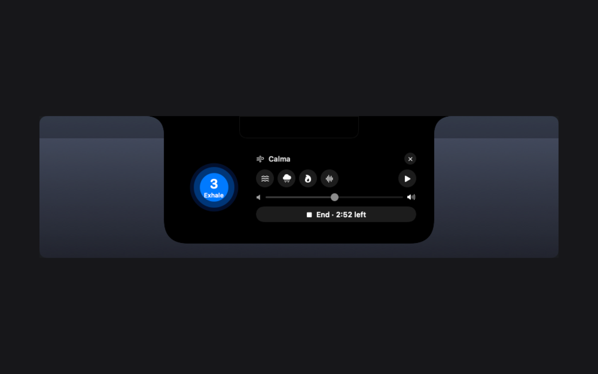
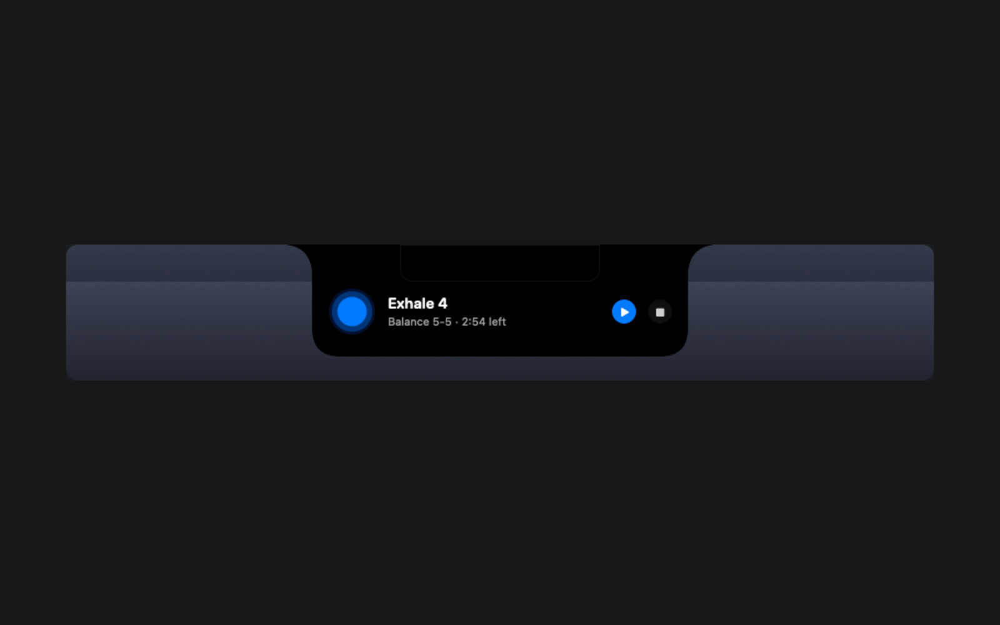

# Calma

Ambient sound and guided breathing in your notch. A Droplet for
[Droppy](https://getdroppy.app), built with
[DroppyKit](https://getdroppy.app/docs/droppykit).



Calma plays **waves, rain, fire or brown noise** from Droppy's shelf, and guides
you through a few minutes of **breathing** when you need to slow down.

- **Synthesised, never looped.** Every sound is generated live on the audio
  thread. No audio files ship in the bundle.
- **The sound breathes with you.** Start a session and the orb grows on the
  inhale and settles on the exhale, and the waves roll in and draw back in
  time with it. Other sounds swell and soften.
- **Three patterns.** Balance (5-5), Box (4-4-4-4) and Relax (4-7-8), for
  1, 3, 5 or 10 minutes, rounded up to end on a whole breath.
- **Everywhere Droppy draws.** A shelf widget in both layouts, a panel in the
  notch, a live activity beside it, a menu bar extra, a settings pane, and a
  "Session complete" HUD with your streak.

| Notch panel | Live activity |
| --- | --- |
|  |  |

## Capabilities

| Capability | Why |
| --- | --- |
| `hud` | The "Session complete" card when a breathing session ends |
| `expanded-surface` | Calma's panel in the notch, opened from the menu bar |
| `menu-bar` | The menu bar extra: sounds, volume, and a session |

No network, no files, no microphone. Preferences are the only thing stored.

## Building

Needs the [DroppyKit SDK](https://gitlab.com/droppyformac1/droppykit) with its
`Scripts` on your `PATH`.

```bash
droppykit build      # produce .build/Calma.droplet
droppykit validate   # the checks a submission runs
droppykit run        # open it in the DroppyKit harness
```

On a Mac with only the Command Line Tools (no Xcode), point the build at the
macOS 26.5 SDK first:

```bash
export SDKROOT=/Library/Developer/CommandLineTools/SDKs/MacOSX26.5.sdk
```

## Source layout

- `Sources/Calma/CalmaDroplet.swift`: the droplet, its state, sessions and streak
- `Sources/Calma/Breathing.swift`: patterns and the pure breath timing model
- `Sources/Calma/SoundEngine.swift`: the synthesiser and the audio engine
- `Sources/Calma/CalmaViews.swift`: every surface Calma draws

## License

MIT. See [LICENSE](LICENSE).
